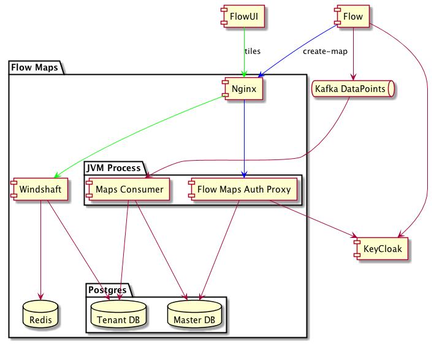
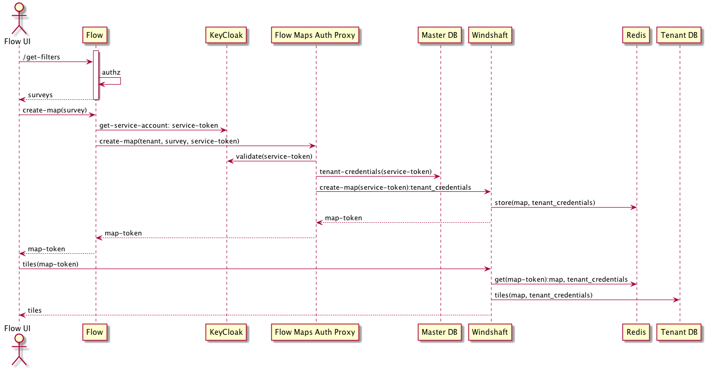

# Akvo Flow Maps

Implementation of maps for Akvo Flow, based on Windshaft.

## Architecture

Flow will push datapoints to a Kafka queue (one per tenant) and Flow Maps will store the required data in 
a Postgres DB (one per tenant) that will later be used by Windshaft to draw the tiles.

The components:



Notes:

1. Nginx is the only component exposed to the external world
1. The tenant dbs are created when the first datapoint is received
1. The map consumer and the auth proxy are right now running in the same JVM process

## API

The Kafka consumer will consume any topic that matches the regex .\*datapoint.\*.. It expects an avro message with the schema as defined at [Akvo Flow Schemas](https://github.com/akvo/akvo-flow-schemas)

To view a map:
 


1. The auth flow in the diagram is a [Client Credentials Grant](https://tools.ietf.org/html/rfc6749#section-4.4). See also the [the keycloak documentation](http://www.keycloak.org/docs/latest/server_admin/index.html#_service_accounts).
1. The auth proxy checks that the JWT token has a "akvo_flow_maps_client" role.
1. The /create-map API expects a POST request with a JSON body with two keys:
   1. topic: the name of the Kafka topic that the data is sent to.
   1. map: a Windshaft [MapConfig](https://github.com/CartoDB/Windshaft/tree/master/doc)

## Developing

To begin developing:

```sh
docker-compose up
```

A Clojure REPL will be listening on port 47480.

Nginx will be listening on localhost:7070, with an [example UI](http://localhost:7070).

To add an example dataset, look at the akvo.flow.maps.push-some-test-data namespace in the test directory.

### Testing

Testing is fastest through the REPL, as you avoid environment startup
time.

```clojure
(dev/test)
```

To run the unit tests:

```sh
docker-compose exec flow-maps lein test
```

or the integration tests:

```sh
docker-compose exec flow-maps lein test :integration
```

## Legal

Copyright © 2017 Akvo Foundation

Distributed under the GNU Affero General Public License 3.0